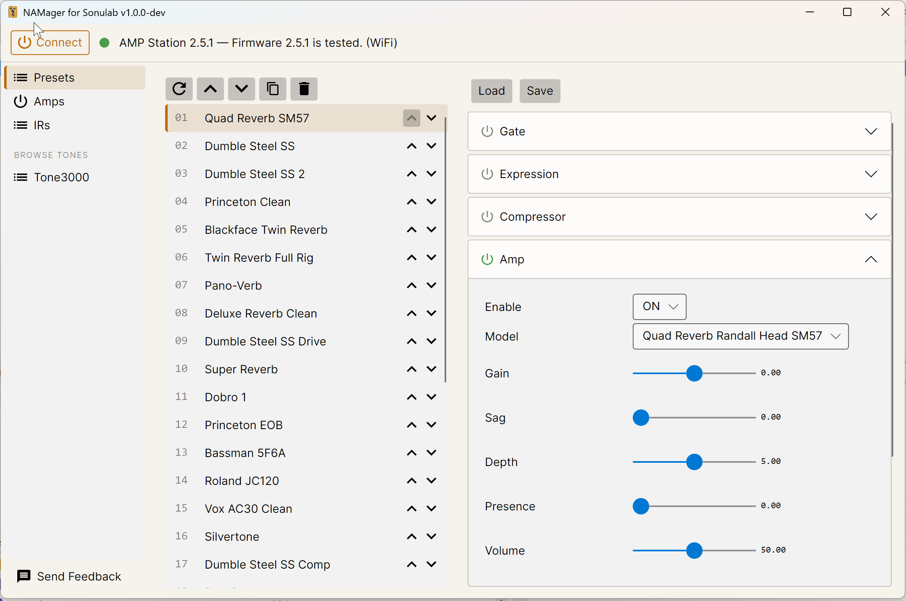

# NAMager for Sonulab

A fast desktop app (Avalonia / .NET 10) to manage a **Sonulab StompStation** ("AMP Station",
ESP32-S3) guitar pedal over USB serial - list, reorder, duplicate, rename, delete, edit, and
back up presets, fixing the slow VoidX-Control workflow.

## Install

### Windows

1. Grab the latest `.msi` from the [Releases page](https://github.com/EdHubbell/Namager.Sonulab/releases/latest).
2. Run it. Windows SmartScreen will warn that the app is unrecognized (the installer is
   unsigned) — click **More info → Run anyway**. Installation is per-user: no admin rights
   needed, and .NET does not need to be installed.
3. Launch **NAMager for Sonulab** from the Start Menu. Close VoidX-Control first — it
   holds the pedal's COM port.

NAMager connects over USB first and falls back to **WiFi** automatically when the pedal is on
your network (same protocol, auto-discovered via mDNS) — handy when a cable or USB port lets you down.
But really, best to stick with a USB connection. **WiFi** might have been an overreach for compatibility sake.

Updating: the app tells you when a new version is available; download and run the new
`.msi` and it upgrades in place.

## Feedback

Use **Send Feedback** (bottom-left in the app). Your message — including the name and
email you enter — is posted as a public [GitHub issue](https://github.com/EdHubbell/Namager.Sonulab/issues)
so you can follow the discussion.

## FAQ

### Why?

Ed got a StompStation to use with his pedal steel guitar. The hardware performance was great - Running direct 
into a PA speaker is really convenient, and trying out different tones using NAM is fun. 

On the other hand, using the VoidX app that ships with the StompStation is not fun. There are no controls to change what slot 
the presets are in. It's kind of a pain to view the list of NAM amps and IR files on your pedal. 
The overall UI is difficult to navigate. 

For most of us, the StompStation is a toy that we want to enjoy playing with *while making music*. 

NAMager helps you work with your pedal faster, so you spend more time playing tones and less time 
managing them. 

### NAMager?

NAMager sounds like how a 3 year old would say manager. So that's fun. Fun is good and should be had.

### Did you just vibe code this app with AI?

Absolutely. I'm writing this readme by hand, tho. Some of it, anyway. 

### Isn't the VoidX upload format proprietary?

Yes, but AI reverse engineered it. Sounds good to me. If you don't like what it uploads, you can go back to using VoidX. There are no problems switching 
back and forth between apps, at least with firmware version v5.2.1. It is possible that Sonulab could change the firmware in such a way that 
makes it impossible to run NAMager. 

### Will this work with StompStation Pro?

No, I don't have one of those. Tell Sonulab to send me one if you want that. 

# Weedy Details

## Status
Reverse-engineering / Phase 0 complete.

## Docs
- [`PROTOCOL.md`](PROTOCOL.md) — the VoidX wire protocol (verbs, framing, slot model, write paths).
- [`docs/PHASE0-protocol-discovery.md`](docs/PHASE0-protocol-discovery.md) — discovery log.
- [`docs/superpowers/specs/2026-06-15-sonulab-control-app-design.md`](docs/superpowers/specs/2026-06-15-sonulab-control-app-design.md) — design spec.
- `docs/probe-output.txt` — full device node-tree dump (generated; gitignored).

## Protocol at a glance
Plaintext over USB serial (CH340, `COM6`, 115200 8N1), BLE, or WiFi. Commands are NUL-terminated
ASCII; responses are CRLF-separated `path:{...}` records. Five verbs: `read`, `browse`, `write`
(+`"save":"save"`), `dread`, `dwrite`. 30 slots each for presets/amps/IRs. Preset content is
written via **save-from-live-state** (save targets the slot matching the name), not `dwrite`.

## tools/ (PowerShell reference scripts; precursors to the C# port)
- `probe.ps1` — read-only: auto-detect port/baud, dump the device node tree.
- `dread_verify.ps1` — read-only: read a preset slot's blob and compare to a `.pst`.
- `write_slot.ps1` — guarded slot write (backup + read-back verify).
- `save_experiment.ps1` — load a `.pst`'s params + save-as to a named slot.

## presets/
Real exported `.pst` presets (the pedal's own `root\presets` format), used as round-trip test data.

## Hardware note
Writing presets changes the pedal's live/active state. The app takes backups before writes and
verifies by read-back. The pedal's `.pcapng` captures live in the parent folder (not committed).
